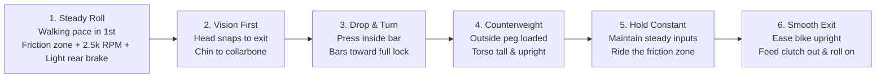

# Control: The Art of Slow-Speed Motorcycle Mastery

> Precision control, balance, and the physics of the full-lock U-turn.

---

## 🏍️ The Full-Lock U-Turn — Step by Step

### 1. Setup

* **Location:** Empty, flat, clean asphalt (e.g., an open parking lot early morning). Ensure no gravel, oil, or slope.
* **Gear:** Full protective gear.
* **Fuel:** Fuel tank half-full or less (lowers total weight and center of gravity).
* **Warm-up:** Tyres and engine warm.
* **Know your turn-out radius:** At a stop, turn the bars to full lock in one direction and note how tight the bike wants to turn. That is your target circle—*it is tighter than you think*.

---

### 2. The Three Inputs — Hold All Constantly

| Control | Technique & Nuance |
| :--- | :--- |
| **Clutch** | Pull in past the friction point, then ease out to where the bike just begins to pull. **Live in that 3–5 mm friction zone window the whole turn.** If you need less speed, pull in slightly; for more speed, ease out slightly. *You are slipping the clutch intentionally.* |
| **Throttle** | Set slightly above idle (**2,000–3,000 RPM**) and **freeze your wrist**. A constant, slightly elevated engine speed provides the gyroscopic stability and driving force holding the bike up. *The single biggest cause of dropping the bike is rolling off the throttle mid-turn.* |
| **Rear Brake** | Rest your foot on the pedal and apply light, steady pressure (equivalent to **5–10 kg** on a bathroom scale). This tensions the drivetrain, pulls the bike into a tighter arc, and eliminates chassis wobble. **Front brake stays 100% released**—a dab of front brake at full lock causes the front end to tuck and drop instantly. |

```
                ┌──────────────────────────────────────────────┐
                │          RIDING IN THE SWEET SPOT            │
                ├──────────────────────────────────────────────┤
                │  • Throttle: Pulls the bike forward and up   │
                │  • Rear Brake: Holds the bike back & tight   │
                │  • Clutch: Balances & modulates between both │
                └──────────────────────────────────────────────┘
```

---

### 3. Body Positioning — Counterweight

* **Shift Weight:** Before entering the turn, slide your butt slightly toward the **outside** of the seat.
* **Peg Pressure:** Weight the **outside footpeg** firmly—press down as if you are standing on it.
* **Torso Posture:** Keep your torso upright (or lean slightly away from the turn direction). The bike drops down into the turn; **you stay tall**.
* **Upper Body:** Keep elbows loose; never fight the handlebars.
* **Relaxed Grip:** Avoid death-gripping the controls. Tension in your hands and arms directly transmits erratic twitches into the steering geometry.

---

### 4. Vision — 50% of the Maneuver

* **Spot the Exit Early:** Before initiating the turn, rotate your head and lock eyes onto your exit point—look all the way over your shoulder, past where you will finish (**chin to collarbone**).
* **Maintain Visual Lock:** Keep looking through the exit the entire turn. *Your hands and handlebars follow your eyes automatically.*
* **Avoid Target Fixation:** Never glance down at the front wheel, ground, curb, or obstacles you fear hitting. *You steer directly into whatever you stare at.*

---

### 5. Execution Sequence



1. **Approach:** Roll at a slow walking pace in 1st gear with the clutch in the friction zone, throttle steady at ~2,500 RPM, and right foot lightly dragging the rear brake.
2. **Initiate Vision:** Turn your head first—lock eyes on the exit point.
3. **Initiate Turn:** Press the inside handlebar / let the bike drop into the lean as the bars move toward full lock.
4. **Counterweight:** Load the outside peg and keep your upper body upright.
5. **Hold Steady:** Hold clutch, throttle, rear brake, and visual focus steady. Avoid abrupt adjustments.
6. **Exit:** As the exit comes into view, ease the bike upright, smoothly feed the clutch out, and gently roll on the throttle.

---

### ⚠️ If the Bike Starts to Fall *Into* the Turn (The Panic Moment)

> **THE SAVE:**  
> Add **throttle and rear brake together** and keep your **eyes up**.

**NEVER DO THESE THREE REFLEXES:**
1. ❌ **Do NOT chop the throttle.**
2. ❌ **Do NOT pull the clutch all the way in.**
3. ❌ **Do NOT touch the front brake.**

*These three panic reactions instantly eliminate drive and guarantee a dropped bike.*

---

## 🎯 Practice Progression

### Phase 1: On a Bicycle (10–15 min sessions)
1. **Slow Coasting Circles:** Ride in a slow circle with both feet on pedals. Turn your head completely around to look behind you through the circle.
2. **Shrink the Radius:** Gradually tighten the circle. Feel the bike lean beneath you while keeping your torso upright.
3. **Tight Figure-8s:** Practice transitioning direction and head checks in a compact footprint.
4. **Track-Stands:** Practice balancing near-stationary to train subconscious micro-corrections.

### Phase 2: On the Motorcycle
1. **Wide Circles:** Establish a large, steady circle with feet up. Practice coordinating clutch slip + steady throttle + gentle rear brake drag.
2. **Inward Spiral:** Spiral inward revolution by revolution until the handlebars hit the steering lock stops, holding full lock steadily.
3. **Direction Change:** Repeat in the opposite direction. *(Expect one direction to feel less natural—spend double the practice time on your weaker side).*
4. **Line-to-Line Figure-8s:** Perform tight figure-8s bounded by two standard parking space lines (~5 m).
5. **Single-Lane U-Turn:** Execute full U-turns within a single lane width (~3.5 m).
6. **The 6-Meter Box:** Mark a 6 m box with chalk/cones and execute clean U-turns inside it (*the standard police motor-officer / advanced licensing test*).
7. **Advanced Refinement:** Progress to one-handed low-speed control with full head turns.

---

> 💡 **Remember:** Reps beat theory. **20 minutes of slow-speed circles twice a week** will turn a full-lock single-lane U-turn into second nature within a month.
