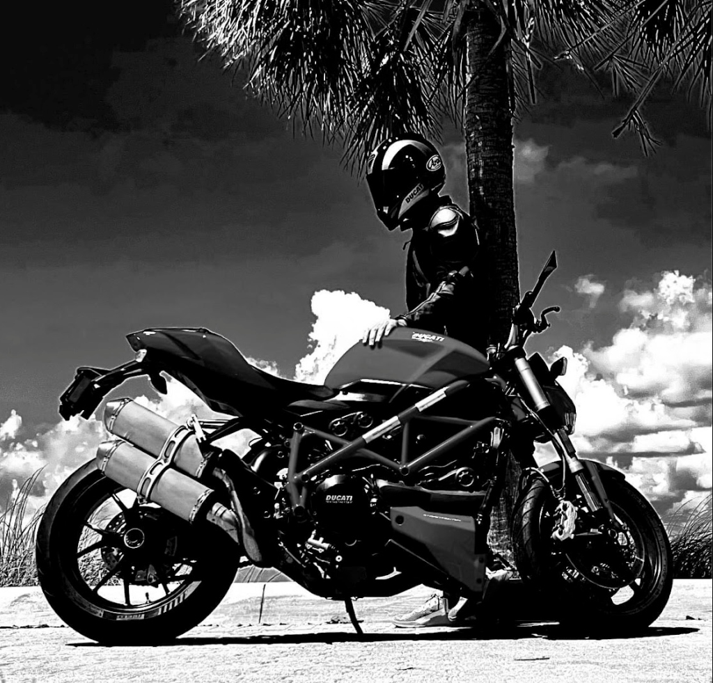
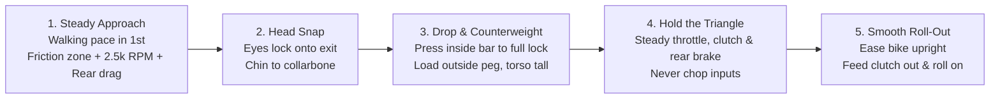

# CONTROL
### The Art & Physics of the Full-Lock U-Turn

 

 

*“A bike at low speed doesn't fall because it's slow. It falls because you stop driving it.”*

---

## 📌 Overview

Mastering slow-speed maneuvering is the definitive mark of motorcycle control. A full-lock U-turn isn’t about muscle—it is a precise balance of three constant inputs, deliberate body counterweighting, and unbroken visual commitment.

---

## 🏍️ Step-by-Step Execution

### 1. Setup

* **Location:** Empty, flat, clean asphalt (e.g., an open parking lot early morning). No gravel, oil, or slope.
* **Gear:** Full protective riding gear.
* **Fuel:** Tank half-full or less (lowers overall weight and center of gravity).
* **Warm-up:** Tyres and engine up to operating temperature.
* **Know your turn-out radius:** At a stop, turn the bars to full lock one way and note how tight the bike wants to go. That is your target circle—*it's tighter than you think*.

---

### 2. The Three Inputs — Hold All Constantly

> [!IMPORTANT]
> Think of it as: **Throttle** pulls the bike forward and upright, **Rear Brake** holds it back and tight, and **Clutch** modulates between the two. You are riding the bike suspended between the engine drive and the rear brake.

| Input | Technique & Nuance |
| :--- | :--- |
| **Clutch** | Pull in past the bite point, then ease out to where the bike just pulls. **Live in that 3–5 mm window the whole turn.** If you need less speed, pull in slightly; more, let out slightly. *You are slipping it on purpose.* |
| **Throttle** | Set it slightly above idle (**2,000–3,000 RPM**) and **freeze your wrist**. A constant, slightly elevated engine speed is what holds the bike up. *The single biggest cause of dropping it is rolling off the throttle mid-turn.* |
| **Rear Brake** | Rest your foot on it and apply light, steady pressure (like standing on a bathroom scale reading **5–10 kg**). This pulls the bike into a tighter arc and deletes the wobble. **Front brake stays fully released**—a dab of front at full lock = the bike tucks and goes down instantly. |

---

### 3. Body — Counterweight

* **Shift:** Before initiating the turn, shift your butt slightly to the **outside** of the seat.
* **Peg Pressure:** Weight the **outside footpeg**—press down firmly like you're standing on it.
* **Torso:** Keep your torso upright (or lean it slightly away from the turn). The bike drops in; **you stay tall**.
* **Arms & Hands:** Keep elbows loose; don't fight the handlebars. Loose grip—death-gripping transmits every upper-body twitch into the steering.

---

### 4. Vision — 50% of the Maneuver

* **Spot the Exit:** Before you initiate, turn your head and find your exit point—look over your shoulder, past where you will finish (**chin to collarbone**).
* **Hold the Line of Sight:** Keep looking there the entire turn. *Your hands follow your eyes automatically.*
* **Avoid Target Fixation:** Never glance down at the front wheel or the curb/edge you're worried about. *You steer into whatever you stare at.*

---

### 5. Execution Flow

1. **Approach:** Rolling at a slow walking pace in 1st gear, clutch in the friction zone, throttle steady at ~2,500 RPM, right foot lightly on the rear brake.
2. **Head turns first:** Eyes locked on the exit.
3. **Press the inside bar:** Let the bike fall into the lean, steering bars moving toward full lock.
4. **Counterweight:** Outside peg loaded, body upright.
5. **Hold everything steady:** Clutch, throttle, rear brake, eyes. Do not change anything abruptly.
6. **Exit:** As you see the exit come up in your vision, ease the bike upright, feed the clutch out, and roll on gently.

---

### ⚠️ If It Starts to Fall *Into* the Turn (The Panic Moment)

> **THE SAVE:** Add **throttle and rear brake together**, keep your **eyes up**.

**DO NOT:**
- ❌ **Chop the throttle**
- ❌ **Grab the clutch all the way in**
- ❌ **Touch the front brake**

*Those are the three reflexes that turn a save into a drop.*

---

## 🎯 Practice Progression

### Phase 1: On the Bicycle (10–15 min sessions)
1. **Slow Circles:** Ride a slow circle, both feet on pedals, coasting. Turn your head and look behind you through the circle.
2. **Shrink the Radius:** Feel the bike lean beneath you while keeping your torso upright.
3. **Figure-8s:** Practice transitions and head-turns in a compact footprint.
4. **Track-Stand:** Balancing near-stationary trains subconscious micro-corrections.

### Phase 2: On the Motorcycle
1. **Big Lazy Circle:** Feet up, one direction. Steady clutch + throttle + slight rear brake drag.
2. **Inward Spiral:** Spiral inward turn by turn until the bars hit the lock stop and you can hold it.
3. **Switch Direction:** Do it the other direction. *(You'll be noticeably worse one way—spend double the time there.)*
4. **Figure-8:** Between two parking space lines (~5 m).
5. **Single Lane U-Turn:** Full U-turn inside one lane width (~3.5 m).
6. **The 6m Box:** Mark a 6 m box with cones/chalk and do U-turns inside it (*the standard motor-officer test*).
7. **Refinement:** One hand on the bars, head fully around, tighter radius.

---

*Reps beat theory here. 20 minutes of slow circles, twice a week, and in a month a full-lock U-turn in one lane feels normal.*

